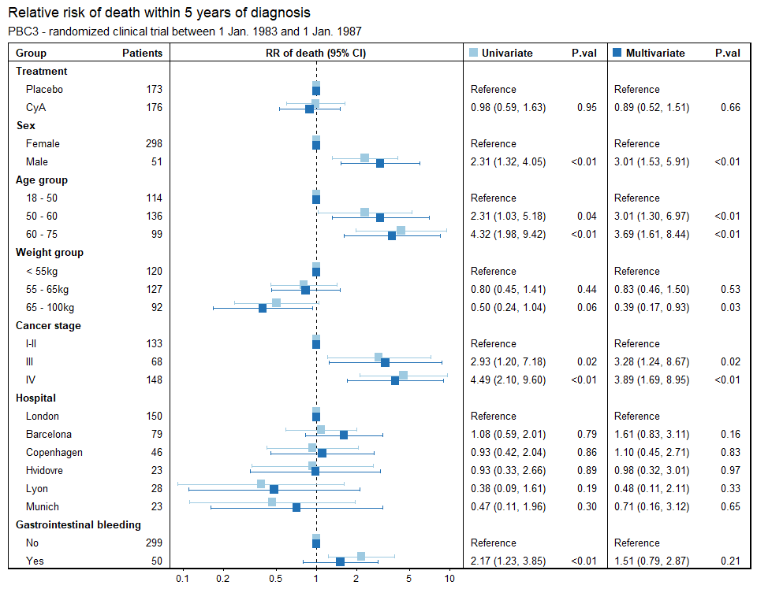

<!-- README.md is generated from README.Rmd. Please edit that file -->

# multiforest

This package is a modification (with a very limited scope) of the very
nice package `forestmodel` that is available here:
[Github](https://github.com/NikNakk/forestmodel)

multiforest will take a dataset and run uni- and multivariate
poisson/binomial regressions on a binary outcome variable. These plots
can take time to construct manually and one nice thing of using this
package is that it makes it easy to do compare across sensitivity
analyses (like how does results change when this group is excluded, or
definition of outcome variable is changed)

## Installation

``` r
devtools::install_github("LarsHernandez/multiforest")
```

# Data

``` r
library(forestmodel)
library(tidyverse)
library(rlang)
library(labelled)
library(survival)
library(pec)
library(knitr)
library(multiforest)
library(kableExtra)

source("R/forestmodels_new_test.r")
```

First we need some data, i take some random clinical trial data from the
package `pec` and define 5 year survival. It’s important only to leave
the data that will be contained in the models.

``` r
data(Pbc3, package = "pec")

pb <- Pbc3 %>%
  transmute(
    dead5yr = if_else(days < (365 * 5) & status == 2, T, F),
    tment   = if_else(tment == 0, "Placebo", "CyA"),    
    sex     = if_else(sex == 1, "Male", "Female"),
    age = case_when(
      between(age, 0, 50) ~ "18 - 50",
      between(age, 50, 60) ~ "50 - 60",
      between(age, 60, 140) ~ "60 - 75"),
    weight = case_when(
      between(weight, 0, 55) ~ "< 55kg",
      between(weight, 55, 65) ~ "55 - 65kg",
      between(weight, 65, 100) ~ "65 - 100kg"),
    stage = case_when(
      stage < 3 ~ "I-II",
      stage == 3 ~ "III",
      stage == 4 ~ "IV",
      is.na(stage) ~ "IV"),
    unit = case_when(
      unit == 1 ~ "Hvidovre",
      unit == 2 ~ "London",
      unit == 3 ~ "Copenhagen",
      unit == 4 ~ "Barcelona",
      unit == 5 ~ "Munich",
      unit == 6 ~ "Lyon"),
    gibleed = if_else(gibleed == 1, "Yes", "No")) %>%
  mutate(unit  = fct_relevel(unit, "London"),
         tment = fct_relevel(tment, "Placebo"))

kable(head(pb))
```

<table>
<thead>
<tr>
<th style="text-align:left;">
dead5yr
</th>
<th style="text-align:left;">
tment
</th>
<th style="text-align:left;">
sex
</th>
<th style="text-align:left;">
age
</th>
<th style="text-align:left;">
weight
</th>
<th style="text-align:left;">
stage
</th>
<th style="text-align:left;">
unit
</th>
<th style="text-align:left;">
gibleed
</th>
</tr>
</thead>
<tbody>
<tr>
<td style="text-align:left;">
TRUE
</td>
<td style="text-align:left;">
CyA
</td>
<td style="text-align:left;">
Male
</td>
<td style="text-align:left;">
60 - 75
</td>
<td style="text-align:left;">
65 - 100kg
</td>
<td style="text-align:left;">
IV
</td>
<td style="text-align:left;">
London
</td>
<td style="text-align:left;">
No
</td>
</tr>
<tr>
<td style="text-align:left;">
FALSE
</td>
<td style="text-align:left;">
CyA
</td>
<td style="text-align:left;">
Female
</td>
<td style="text-align:left;">
18 - 50
</td>
<td style="text-align:left;">
55 - 65kg
</td>
<td style="text-align:left;">
III
</td>
<td style="text-align:left;">
London
</td>
<td style="text-align:left;">
No
</td>
</tr>
<tr>
<td style="text-align:left;">
FALSE
</td>
<td style="text-align:left;">
CyA
</td>
<td style="text-align:left;">
Female
</td>
<td style="text-align:left;">
18 - 50
</td>
<td style="text-align:left;">
65 - 100kg
</td>
<td style="text-align:left;">
III
</td>
<td style="text-align:left;">
London
</td>
<td style="text-align:left;">
No
</td>
</tr>
<tr>
<td style="text-align:left;">
TRUE
</td>
<td style="text-align:left;">
CyA
</td>
<td style="text-align:left;">
Female
</td>
<td style="text-align:left;">
60 - 75
</td>
<td style="text-align:left;">
&lt; 55kg
</td>
<td style="text-align:left;">
IV
</td>
<td style="text-align:left;">
London
</td>
<td style="text-align:left;">
Yes
</td>
</tr>
<tr>
<td style="text-align:left;">
TRUE
</td>
<td style="text-align:left;">
CyA
</td>
<td style="text-align:left;">
Female
</td>
<td style="text-align:left;">
60 - 75
</td>
<td style="text-align:left;">
&lt; 55kg
</td>
<td style="text-align:left;">
IV
</td>
<td style="text-align:left;">
London
</td>
<td style="text-align:left;">
No
</td>
</tr>
<tr>
<td style="text-align:left;">
TRUE
</td>
<td style="text-align:left;">
CyA
</td>
<td style="text-align:left;">
Male
</td>
<td style="text-align:left;">
60 - 75
</td>
<td style="text-align:left;">
55 - 65kg
</td>
<td style="text-align:left;">
IV
</td>
<td style="text-align:left;">
London
</td>
<td style="text-align:left;">
No
</td>
</tr>
</tbody>
</table>

Before plotting we can make headers a bit nicer by applying a label from
the package `labelled` to plot we use the function `mforestmodel` where
we have to specify limits and the dependent variable.

``` r
var_label(pb) <- list(tment = "Treatment",
                      sex = "Sex",
                      age = "Age group",
                      weight = "Weight group",
                      stage = "Cancer stage",
                      unit = "Hospital",
                      gibleed = "Gastrointestinal bleeding")

source("R/forestmodels_new_test.r")

mforestmodel(pb, dependent="dead5yr", lim=c(-2.4,2.4))
```

<!-- -->

There are also a few options included for modifying the plot. For more
options just use the raw function code from gíthub. The final plot is a
ggplot object, and therefore normal options of ggplot can be supplied,
like the labs argument.

``` r
mforestmodel(pb, dependent="dead5yr", lim=c(-2.4,2.4),
             pala="#2171b5", palb="#9ecae1", 
             #legend_position = c(0.55,0.93), 
             spaces = c(0.015,0.22,0.2,0.005,0.2,0.02),
             header = c("Group","Patients","RR of death (95% CI)","Univariate","P.val","Multivariate","P.val")) + 
  labs(title="Relative risk of death within 5 years of diagnosis",
       subtitle="PBC3 - randomized clinical trial between 1 Jan. 1983 and 1 Jan. 1987")
```

<!-- -->

Here is another example with some other data, and we can switch from
poisson (RR) to a binomial/logistic model (OR)

``` r
data(cgd, package = "survival")

cg <- cgd %>% 
  select(treat, sex, hos.cat, status, weight, inherit, height) %>%
  mutate(
    hos.cat = as.character(hos.cat),
    weight = case_when(
      between(weight, 0, 55) ~ "< 55kg",
      between(weight, 55, 65) ~ "55 - 65kg",
      between(weight, 65, 100) ~ "65 - 100kg"),
    height = case_when(
      between(height, 0, 120) ~ "< 1.2m",
      between(height, 120, 150) ~ "1.2 - 1.5m",
      between(height, 150, 220) ~ "1.5 - 2.2m"))
  
var_label(cg) <- list(treat = "Treatment",
                      sex = "Sex",
                      weight = "Weight group",
                      height = "Height group",
                      hos.cat = "Hospital region",
                      inherit = "Inherited")

mforestmodel(cg, dependent="status", lim=c(-3,2), est_family = "binomial")
```

<!-- -->
